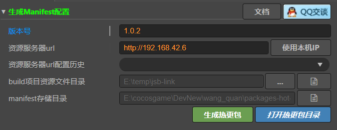
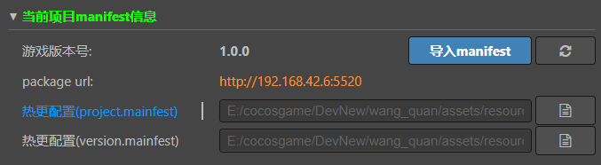
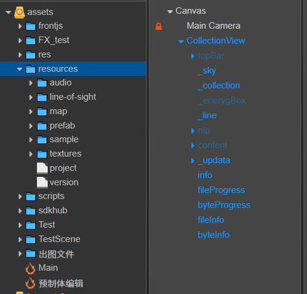
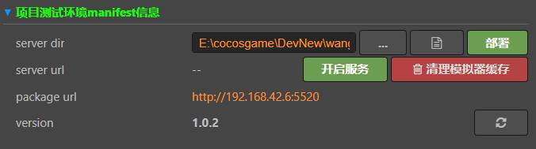

<!--
 * @features: 功能
 * @description: 说明
 * @Date: 2022-06-20 12:30:44
 * @Author: judu233(769471424@qq.com)
 * @LastEditTime: 2022-06-25 16:12:03
 * @LastEditors: judu233
-->
# 热更新文档
## 热更新打包流程
- 首先安装插件
  - 以下情况自动填写 ip, 如果手机和电脑处于同一局域网下，请手动填写电脑的ip
    - 电脑开热点使用
    - 手机开热点使用
    - 手机使用usb连接
- 构建安卓工程（生成要导入的manifest资源列表和对应的版本信息）
  - 
- 打开热更插件填写【生成manifest配置选项】的 ip 和 服务器 url 然后点击生成热更新包
  - 
- 点击【当前项目的 mainfest 信息】导入 mainfest 按钮
  - 
- 把生成在 assets 目录下的 project 和version文件拖放到 resources 的根目录下
  - 
- 再次打包构建编译apk，然后安装到手机上
  - 
- 之后每次只需要构建生成资源表，然后修改配置生成热更新包就可以了，测试的话点击【项目测试环境 mainfest 信息】选项的部署并开启服务
  - 

> 参考教程：
> - [热更新官方教程](https://docs.cocos.com/creator/2.4/manual/zh/advanced-topics/hot-update.html)
> - [热更新管理器](https://docs.cocos.com/creator/2.4/manual/zh/advanced-topics/assets-manager.html)
> - [TinyCocosFix-Cocos热更新](https://oedx.github.io/2021/02/22/TinyCocosFix/#%E8%83%8C%E6%99%AF)
> - [游戏更新教程（包括整包更新，热更新，以及项目中出现的问题）](https://forum.cocos.org/t/topic/78709)
> - [2.4 分包式热更新插件](https://forum.cocos.org/t/topic/136726)