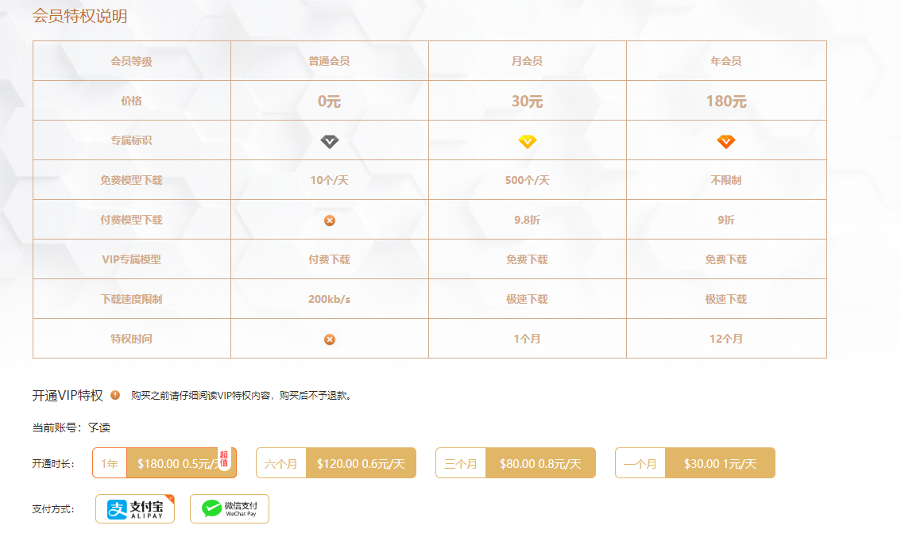
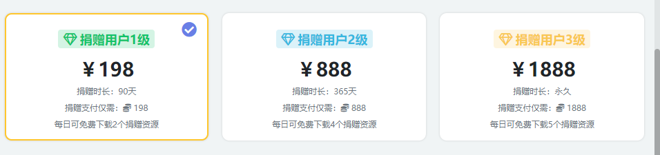
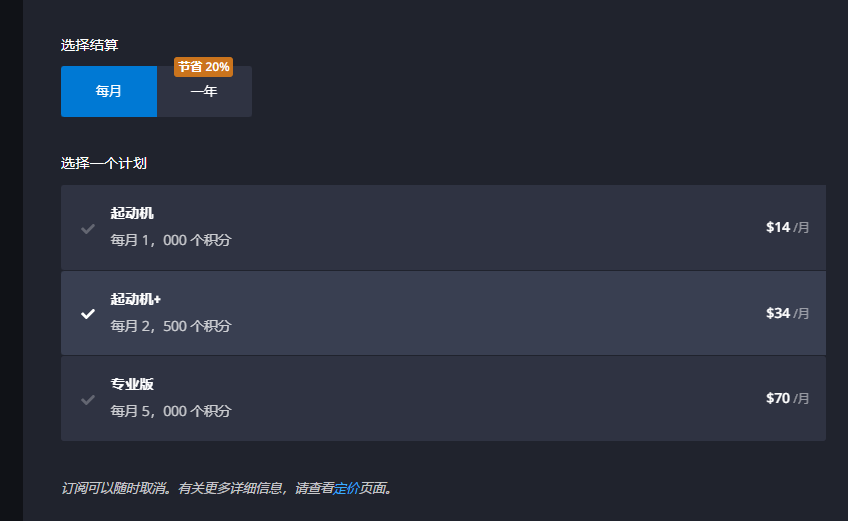
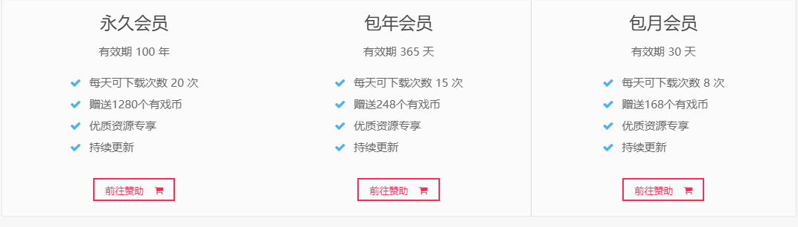
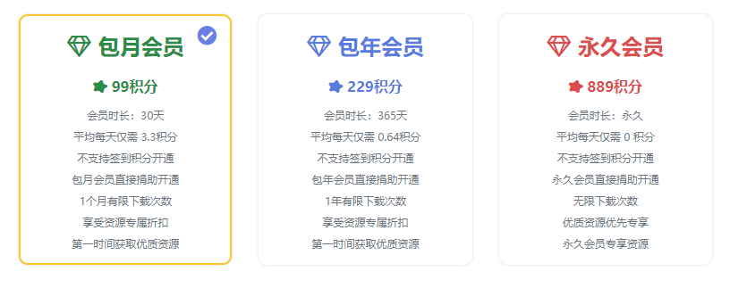
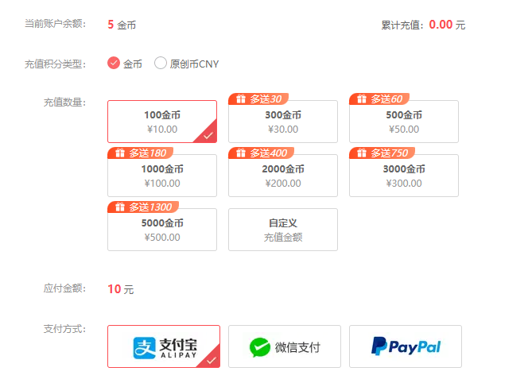
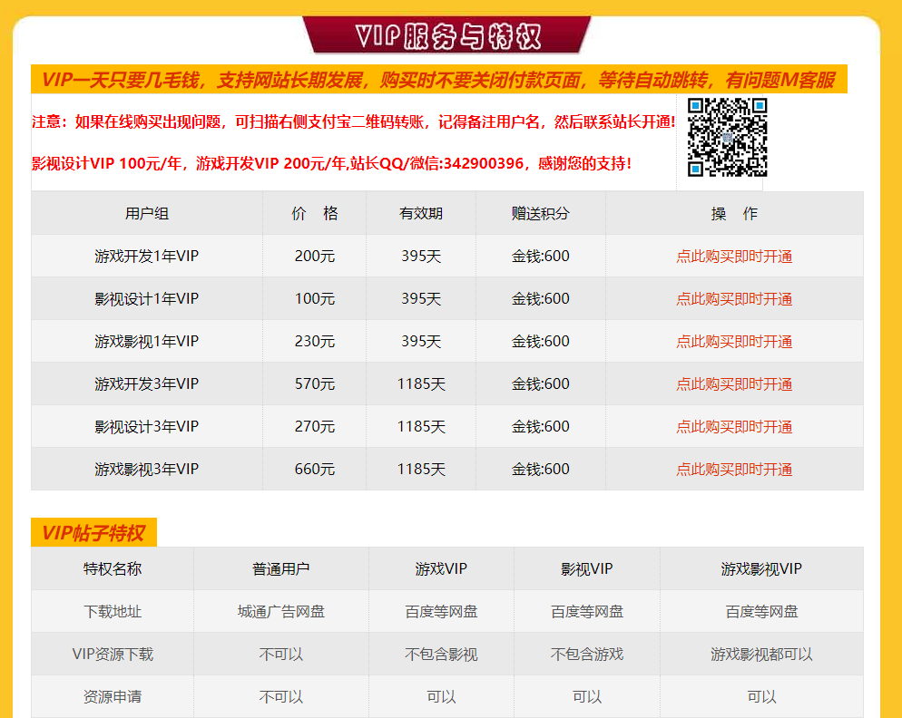
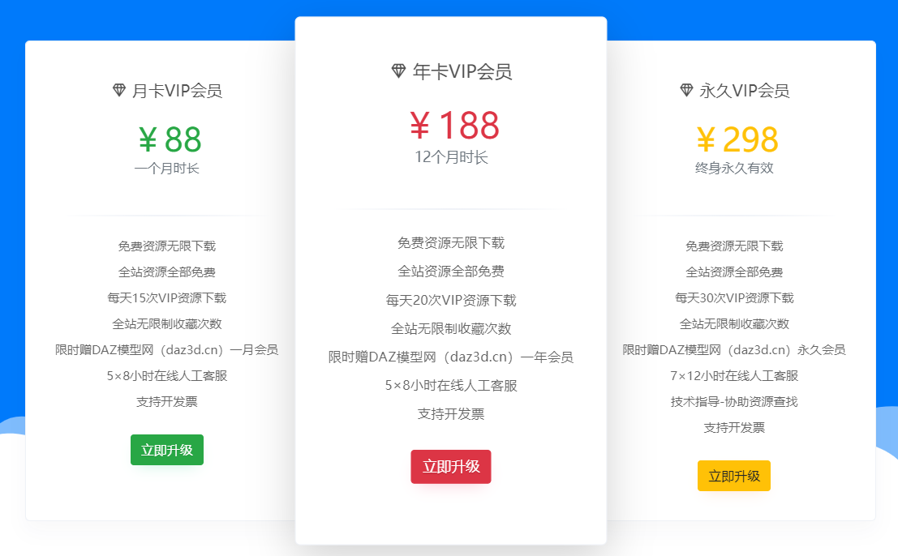
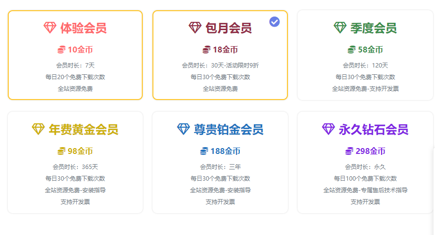
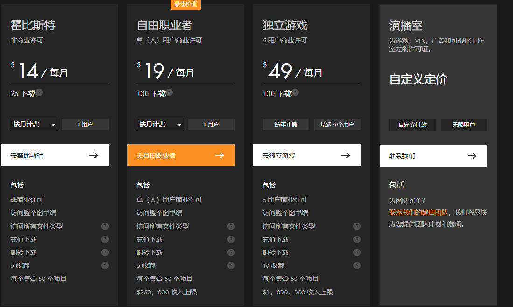

<!--
 * @features: 功能
 * @description: 说明
 * @Date: 2022-05-02 18:32:21
 * @Author: judu233(769471424@qq.com)
 * @LastEditTime: 2022-07-10 17:44:05
 * @LastEditors: judu233
-->

## cg资源网站
- [artstation](https://www.artstation.com/?sort_by=community)
——美术天花板a站
- [cgsociety](https://cgsociety.org/)
——3A高质量网站
- [ggac](https://www.ggac.com/v2/home)
——3A高质量网站
- [surfcg](https://www.surfcg.com/index?by=2) 
——3A高质量网站
- [3dtotal](https://3dtotal.com/)
——也是一个高质量艺术书籍，教育资源和创意灵感
- [polycount](https://polycount.com/)
——质量稍高，算2A
- [半次元](https://bcy.net)
——漫画，绘画等交流论坛（各种futty）
- [80.lv-cg参考](https://80.lv/)
——cg渲染新闻
- [awn](https://www.awn.com/)
——cg动画资讯门户网站
- [fxguide](https://www.fxguide.com/)
——cg,vfx特效的门户网站
- [artofvfx](https://www.artofvfx.com/)
——视觉特效的门户网站
- [TweenMax.js](https://www.tweenmax.com.cn/websites/)
——3d模型特效的网站

### 动画/动作
- [mixamo](https://www.mixamo.com/#/)
——高质量模型/动作库网站
- [bodiesinmotion](https://www.bodiesinmotion.photo/)
——质量还可以的动作网站
- [thinkinganimation](https://thinkinganimation.com/)
——在线动画门户网站，网站加载卡

### 免费
- [unityfly免费资源分享](https://www.unityfly.com/)
——百度网盘下载
- [模之屋](https://www.aplaybox.com/)
——大量公开下载的模型，但是不能商用
- [夕蓝资源网](https://www.seoliye.com/modeler/)
——12,800种资源，不可商用，只能用于个人二次创作。
- [小林MMD](http://mmd.xiaolindraw.com/index.html)
——为mmd爱好者提供多种的模型下载
- [creazilla](https://creazilla.com/zh-CN/sections/3-3d)
——质量一般的，包含ai文件,3d模型，剪影图片，卡通icon
- [0x72免费资源](https://0x72.itch.io/)
——免费像素资源  
- [itch.io](https://itch.io/game-assets/free/tag-2d)
——大型免费资源网站
- [kenney](https://www.kenney.nl/assets)
——kenney免费2d/3d资源
- [pxhere](https://pxhere.com/)
——免费高清商业图片素材
- [poliigon](https://www.poliigon.com/)
——品质一般，免费的材质模型网站
- [ambientcg](https://ambientcg.com/)
——1680个免费的材质模型网站
- [freepbr](https://freepbr.com/)
——高品质免费的pbr网站
- [hdrihaven](https://hdrihaven.com/)
——免费hdr,模型，图片素材网站
- [3d侠](https://www.3dxia.com/mf3dmoxing)
——免费的室内模型
- [bowlroll](https://bowlroll.net/file/index)
——日本第一模型网站，部分免费，部分收费

### 收费
- [turbosquid专业版 3D 模型网站](https://www.turbosquid.com/zh_cn/)
——各种3A-4A高质量模型，价格贵一个模型几百到几千，仅支持paypal
- [渲染之家](https://www.51render.com/)
——各种1A-2A的模型，价格稍贵，几十到几百都有,支持支付宝微信
——
- [cgtrader](https://www.cgtrader.com/zh-cn/3d-models)
——各种2A-4A质量模型,价格稍贵，几十到几百，支持微信，支付宝，paypal,第一次大于购买20美元以上有30%折扣（有各种Furry模型）
- [sketchfab](https://sketchfab.com/)
——各种2A-4A质量模型,价格稍贵，几十到几百，支持payapl，visa,第一次购买20%折扣
- [cg柚子](http://www.cgioo.com/)
——质量较高，包含u3d资源，资源稍便宜，1元10积分，可以使用积分升级用户组
- [玩酷](https://www.wankucg.com/)
——高质量资源网站，包含人物，场景，动物等各种素材
——
- [free3d](https://free3d.com/)
——质量一般，收费较贵，几美元到几十美元
- [blendswap](https://blendswap.com/)
——质量一般，网站加载比较卡
- [greyscalegorilla](https://greyscalegorilla.com/)
——3D 渲染，高质量渲染纹理，价格贵，99美元
- [cgmodel](https://www.cgmodel.com/)
——品质较高，价格较便宜，几十到几百
- [myminifactory](https://www.myminifactory.com/)
——高质量模型网站，价格几美元到几十美元
- [cgtrader](https://cgtrader.com/)
——品质较高的模型网站，价格几美元到几十美元
- [textures](https://www.textures.com/)
——高质量3d模型，材质，图片，网站，有次数限制，收费
——

### vip积分下载
- [i3dtt模型资源](https://www.i3dtt.com/)
——品质中等偏上，unity和虚幻资源，永久1280，包年248，包月168.会员下载次数用完后充值积分1元1积分才能下载
——
- [iiidea资源](http://iiidea.cn/unity3d-zy)
——包含ae,cg,u3d,ue,musse,wp等资源，永久980，包年180， 下载次数无限
- [cgalpha资源](https://www.cgalpha.com/archives/26342.html)
——品质较高，包含模型，脚本，视频，音效，教程等，积分会员制度，积分充值1元1积分或者签到, 会员下载次数用完后充值积分才能下载
——
- [cgvim](https://www.cgvim.com/)
——品质中等偏上，只有u3d和ue资源，支持充值积分1元1积分，1年会员365，3年239，下载次数不限
- [rrcg](https://www.rrcg.cn/)
——品质中等，包含影视，绘画，游戏，设计，摄影教程，素材同等，游戏资源稍多，1元2积分，vip1年398，一个月298，3年1499，永久2499，下载次数不限
- [不移之火](https://www.byzhihuo.com/)
——品质一般，包含游戏美术，漫画，插画，影视，手绘，艺用等素材，游戏相关的资源一般，并且资源比较贵，没有会员制度
——
- [cgsoso](http://www.cgsoso.com/)
——品质一般，包含blender,影视，游戏开发资源（u3d小游戏源码），游戏素材资源一般，没有权限访问不了
——
- [kim魔酷网](https://blender.kim/)
——品质较高的cg模型论坛，3渲2交流，各种2A-3A模型资源和插件资源，签到做任务获取积分/购买积分1元10积分，资源较便宜/有免费的资源
——可以开通投稿会员29.9/12个月，每天20次数下载，赞助会员39.9/12个月，每天25次，超出可以折扣购买
- [blenderco布的](http://blenderco.cn/)
——品质较高的cg模型，免费/收费，可以签到/购买积分（1元/1积分）,赞助会员6.6/一个月和29.9/12个月(每天可下载20个)，可以签到购买赞助会员
- [AN素材库](https://www.ansucai.com/)
——品质较高，包含材质，插件，ue.u3d ,c4d,su,cad,zbrush,blendr,daz,ps等资源教程
——普通用户每日2次下载，月卡88，年卡188，永久298
——
- [朱峰社区](https://www.zf3d.com/)
——质量一般，价格稍贵，一个以包含收费课程为主和模型的论坛为辅，90天198/1年298（3次免费下载），终生698（每天10次下载）
- [cgPao](https://www.cgpao.com/)
——质量一般，资源少，验证码比较恶心，注册签到后可以白嫖1个左右资源，月卡49（15次），年卡99（30次）
- [DAZ模型网](https://www.daz3d.cn/)
——质量中等偏上，资源较便宜，5元1个，可以签到获取积分,可以签到换会员
——
- [magicsart](https://ww2.magicsart.com/)
——品质一般，资源模型网站，网站排版很难受，1元5积分
- [3dyoo](https://3dyoo.cn/)
——质量一般，包含模型，2d美术，网站加载卡，10元100积分
- [cg小霸王](http://www.cgbawang.com/portal.php)
——质量一般，包含资讯，动画，模型，教程等
——

# 声音 素材
- [音频软件大全，你知道几个音频软件，自媒体人都在用的音频软件](https://zhuanlan.zhihu.com/p/61364065)
- [freesound](https://freesound.org/)
- [tosound](https://www.tosound.com/)
- [products（音效）](https://www.krotosaudio.com/products/)  
- [魔王魂](https://maou.audio/)
- [开源免费音频资源](http://audio.wangshaoxing.com/)

### 其他
- [gametextures](https://gametextures.com/)
——高质量材质网站
——
- [badking](https://www.badking.com.au/site/)
——ZBrush资源和开发网站，
- [享云模型网](https://www.xy-share.com/)
——快闭站的资源模型
- [zbrushcentral](https://www.zbrushcentral.com/)
- [vimeo](https://vimeo.com/)
——动画，纪录片，艺术等创意视频综合网站
- [actorcore](https://actorcore.reallusion.com/)
- [3dexport](https://3dexport.com/)
——3D模型，打印和VR/AR等资源网站，网站加载卡，
- [sk](https://www.3d.sk/)
- [AlteredQualia](https://alteredqualia.com/)   
- [models-resource](https://www.models-resource.com/)

### 视觉特效
- [随机粒子](http://www.spielzeugz.de/html5/liquid-particles-3D) 
- [对称光绘](http://weavesilk.com) 
- [高亮流体](https://paveldogreat.github.io/WebGL-Fluid-Simulation) 
- [双色生成](https://duotone.shapefactory.co) 
- [爆炸粒子](https://wangyasai.github.io/Stars-Emmision) 
- [流动的线](https://wangyasai.github.io/Perlin-Noise/) 
- [故障风](https://photomosh.com) 
- [动态倒影](https://watereffect.net) 
- [文字云](https://wordart.com/create) 
- [地图lowpoly生成](https://pissang.github.io/little-big-city/?=true&lng=-74.00705674814816&lat=40.70733175006862&style=planet&config=%7B%22earthDepth%22%3A8.24487334137515%2C%22earthColor%22%3A%22%23d3ffc6%22%2C%22rotateSpeed%22%3A2%7D)
- [craftpix游戏资源](https://craftpix.net/all-game-assets/)
- [pexels](https://www.pexels.com/zh-cn/)
