<!--
 * @features: 功能
 * @description: 说明
 * @Date: 2022-05-22 13:30:29
 * @Author: judu233(769471424@qq.com)
 * @LastEditTime: 2022-06-01 00:16:10
 * @LastEditors: judu233
-->
# Unity 基础
## 1. 游戏引擎 & unity 
- Unity最初是一个游戏引擎，但后来发展成为一种创意工具，被许多不同的行业所使用。话虽如此，Unity仍然保留了其游戏引擎的根源，并且关于如何以及为什么创建它的故事提供了关于它为什么以这种方式工作的见解

### 1.1 游戏引擎
- 游戏引擎（GameEngine）: 可以快速制作游戏的软件框架，其中包含处理图像、声音等素材的预制功能，包含物理引擎等等...  
- 小白可以暂时只记住，它是可以帮助我们快速开发游戏的工具
- 业界双雄：Unity & Unreal （虚幻）
- 免费新秀： Godot, cocosCreator
- 其他引擎 flaxEngie,CryEngine 3,GameMaker：Studio...  

> [零基础到入门](https://xiaoy.blog.csdn.net/article/details/118298538)
> [点击查看Unity官方快速介绍](https://learn.unity.com/tutorial/what-is-unity?language=en&pathwayId=5f7bcab4edbc2a0023e9c38f&missionId=5f777d9bedbc2a001f6f5ec7&projectId=5fa1bcabedbc2a002191eef3#5fa1bd7dedbc2a001f53e32f)   
> [游戏开发行业](https://juejin.cn/post/6844904183552819214)
***

## 2. Unity 安装运行使用
### 2.1 Unity Hub
unity版本管理中心作用：可简化查找、下载和管理 Unity 项目和安装内容。  
unity管理中心，unity 有很多版本，更新很频繁，很多版本并不互相兼容，就需要有一个管理中心来统一管理不同版本的 unity.

### 2.2 Unity hub 下载安装使用
- 使用流程
  - 注册 unity 账号
    - [注册账号](https://id.unity.com/zh/conversations/21180219-f899-4481-b894-b933982b424700bf)
  - 下载安装打开 unity hub
    - [unity 2021.X 版本以及hub下载](https://unity.cn/releases)  
    - [unityHub官方文档介绍资料](https://docs.unity.cn/cn/2021.1/Manual/GettingStartedUnityHub.html)  
  - 登录 unity 账号，申请/刷新许可证
    - unity 虽然开源，但并不完全免费，分多个版本，个人版免费，专业版和企业版收费，所以需要许可证激活才能使用。
普通用户学习或非盈利性使用时，应选择个人版，申请对应的许可证激活 unity
具体操作步骤，参照 
    - [许可证和激活官方文档](https://docs.unity.cn/cn/2021.1/Manual/LicensesAndActivation.html)
  - 通过hub选择 unity 版本，下载，安装
    - 1. 直接打开指定版本的 unity ，打开项目（还是会自动打开hub）
    - 2. 通过 unity hub 直接打开项目（推荐）
    - [运行 unity 官方文档](https://docs.unity.cn/cn/2021.1/Manual/GettingStarted.html)
  - 新建/导入项目并运行

***

## 3. 游戏总体介绍
### 3.1 Unity 中的 2D 游戏
> [官方手册文档-2D](https://docs.unity3d.com/cn/2021.2/Manual/Unity2D.html)
> [开始 2D 游戏开发系列](https://learn.unity.com/course/beginning-2d-game-development?language=en)
> [官方手册文档-2D 还是 3D 项目](https://docs.unity3d.com/cn/2021.2/Manual/2Dor3D.html)  
> [2d/3d 模式](https://docs.unity3d.com/cn/2021.2/Manual/2DAnd3DModeSettings.html)

#### 2d的默认设置
- 启用 2D 模式时将会设置正交（即无透视）视图：摄像机沿 Z 轴观察，而 Y 轴向上增加。  
- 在 2D 项目模式下：  
  - 所有图像（images）都会被当做 2D 图片，并设置成 sprite mode 精灵模式
  - Sprite Packer 会被启动
  - Scene 视图默认为 2D
  - 默认游戏对象没有实时方向光。
  - 摄像机的默认位置为 0,0,–10。（在 3D 模式下为 0,1,–10。）
  - 相机投影默认设置为正交(在 3D 模式下是透视图)，没有远小近大，没有距离之分
  - 在 Lighting 窗口中：
    - 新场景默认禁用Skybox
    - 环境光源默认设置为颜色. (颜色默认设置为深灰色: RGB: 54, 58, 66.) 包围光源设置为 color
    - 实时全局照明（照明）默认设置为关闭。
    - 全局光照烘焙默认关闭
    - 自动烘焙默认关闭

- 设置项目默认模式：Edit > Project Settings > Default Behavior Mode

### 3.2 2D游戏的常用视角
- 自顶向下
- 侧面
- 等距和 2.5D

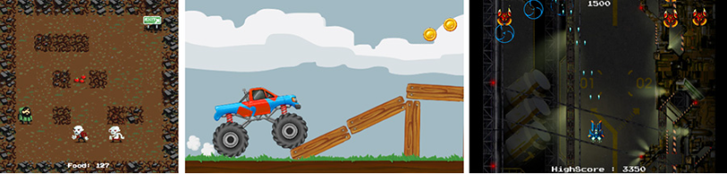

### 3.3 2D游戏常用的美术风格
- 极简主义
- 像素
- 插画
- 预渲染 3D

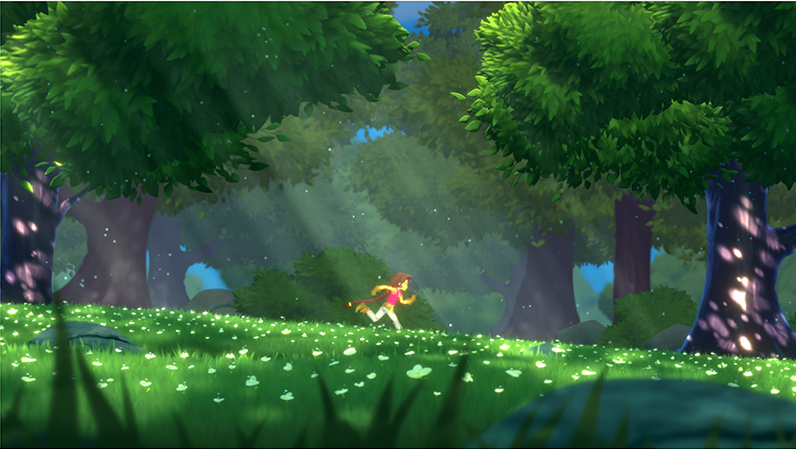

### 3.4 2D&3D 游戏设计流程  
#### 3.4.1 概念简介
Environment Art 环境艺术：  
2D&3D 游戏中的环境艺术，是一个大范围的统称，可以简单理解为所有关卡设置的集合，所有关卡合在一起，就是整个游戏环境。
关卡：一个关卡 level，在 Unity 中，可以通常用一个场景 Scene 来表示

#### 3.4.2 流程简介
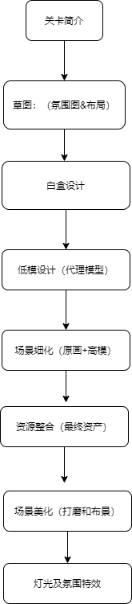

#### 3.4.3 关卡简介（文字概要设计）
关卡的文字概念设计
这可以是作者的故事或目标的描述，需要在关卡的游戏过程中发生。有时级别简报就像一两句话一样简单。关卡简介通常在关卡启动会议期间呈现给概念美术师、关卡设计师和环境美术师。一个好的关卡简介足以让团队兴奋，但也足以让美工们探索一些更大的想法。它还有助于为这个新关卡与其前后关卡的联系方式提供背景信息。

#### 3.4.4 草图（氛围图&布局图）
在级别启动会议之后可以采取两个主要方向。一个是创建一些关键艺术，另一个是创建一些高级布局。如果他们有资源/时间，一些团队实际上会两者兼而有之。关键艺术通常是精美的画作，清楚地定义了情绪和调色板以及一些设计。他们还让团队兴奋，并帮助每个人朝着同一个愿景前进。高级布局旨在定义游戏玩法的关卡节拍和可能的想法。
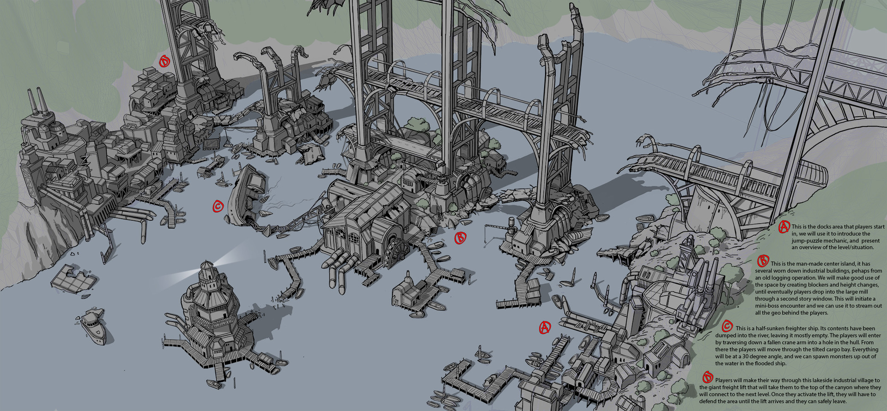

#### 3.4.5 白盒设计
关卡设计师会用简单的几何体制作关卡来测试空间以及游戏机制，因为便于验证和修改。在这个阶段美术是可以参加进来及早发现一些问题的，下面是白盒以及对应的原画设计图：
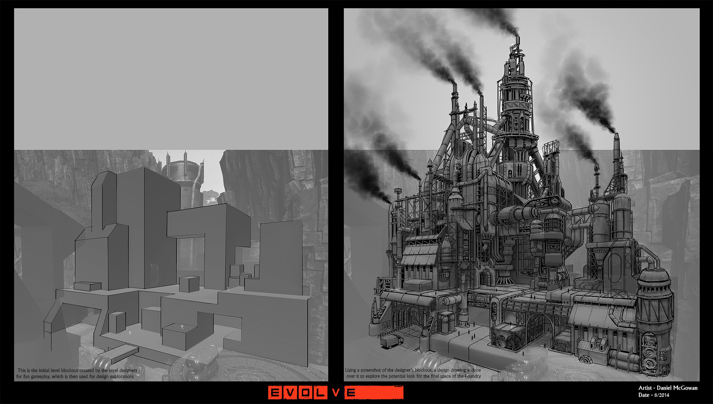
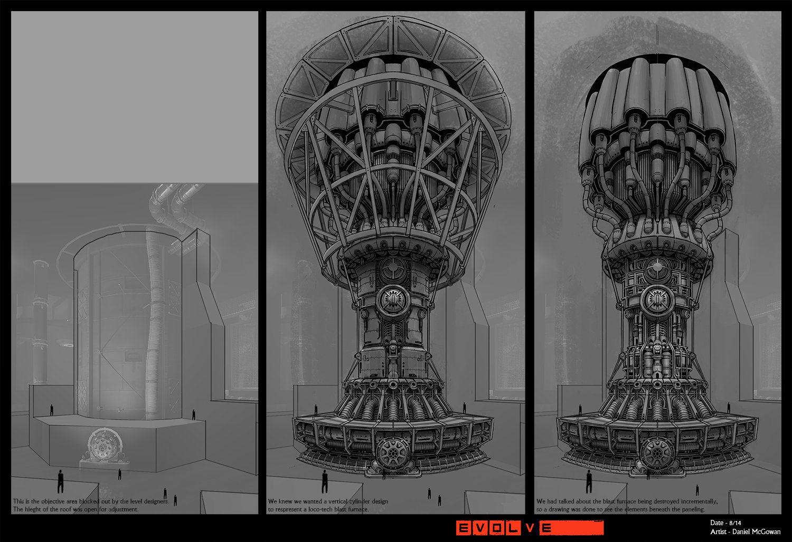

#### 3.4.6 低模设计（代理阶段）
就是简单模型替代几何体，模型使用的多边形个数较少，但已经可以看出较为清晰的轮廓和外观
代理可以让团队开始跟踪他们需要多少资产才能最终完成并阻止模块化集膨胀过大。如果代理对概念是准确的，那么世界构建者此时也可以开始拨入作品。一个好的代理侧重于轮廓、准确的比例和清晰的材料分组。
下面左边是原画，右边是低模
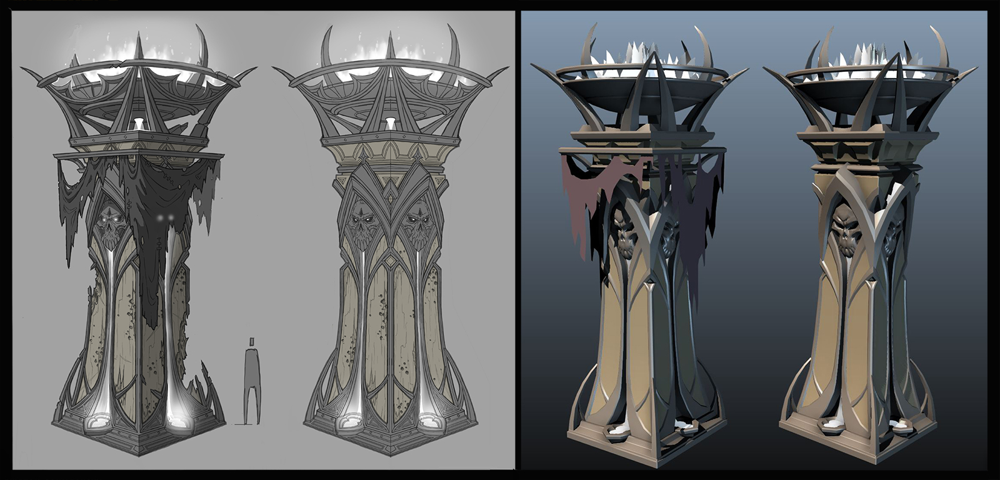

#### 3.4.7 场景细化（原画细化+高模建模）
细致的原画设计出来后，可以辅助 3D 美工，将低模细化为高模
这个过程通常和上面的过程交错进行
下面就是细化过的原画：
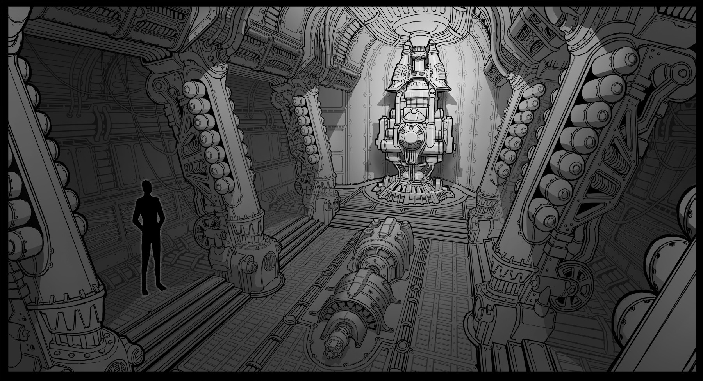
下图左边是原画，右侧是高模
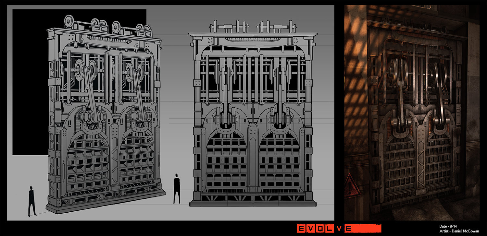

#### 3.4.8  资源整合（最终资产）
所有的场景资源在这个阶段进行融合
流程:
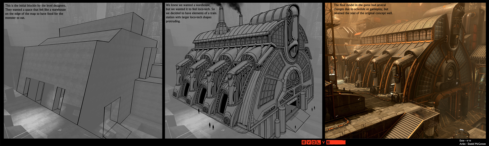

#### 3.4.9 场景美化（打磨+布景）
锦上添花的阶段，丰富和完善场景，让其更加生动
灯光和特效，进一步烘托场景所需要的氛围，进而影响玩家在玩游戏时的心情，增强代入感
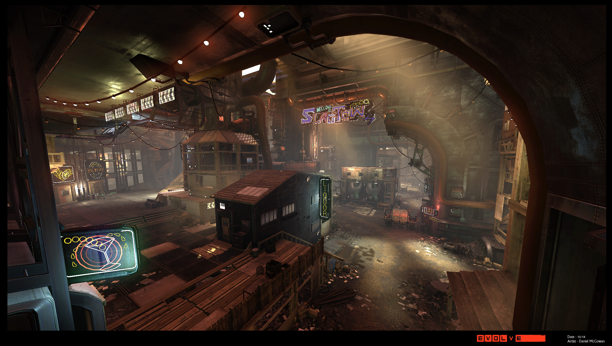

#### 3.5.1 模块化资源
将可以重复使用的资源模块化，可以极大提升整个环境的创建速度
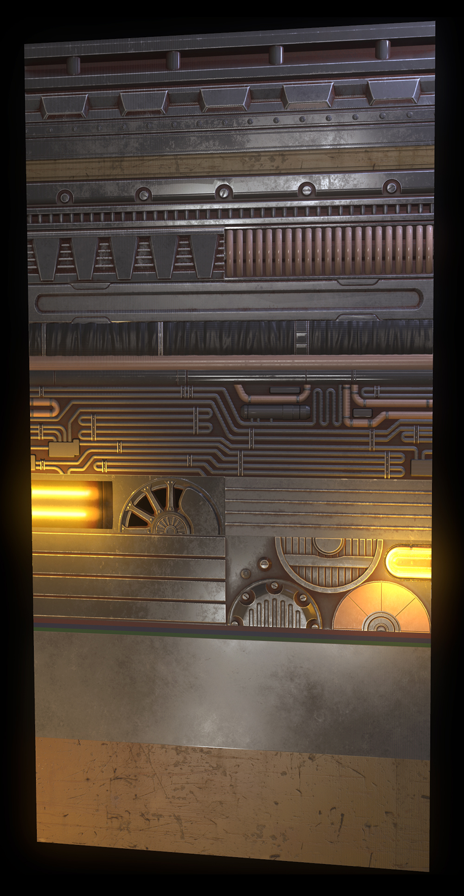
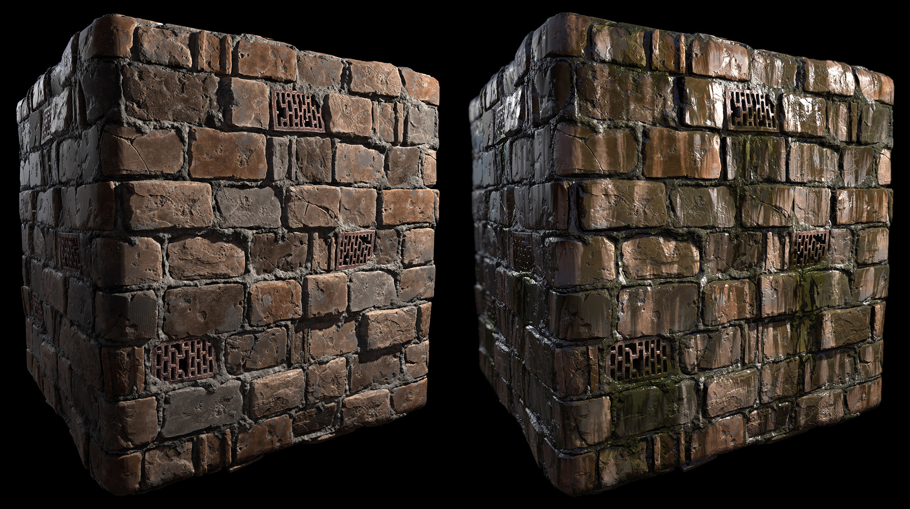

这个流程仅仅是比较通用的一种方式，并非铁律，不同团队可以根据自己的特点进行调整，以此为参考即可。

> 参考资料：
> [Gamedev 中的环境艺术流程](https://80.lv/articles/the-stages-of-environment-art-in-gamedev/)

***

## 4. 预置文件 Prefab 和 资源管理
预制体（预制件） Prefab：
预先配置好的，具备一定功能的的 Game Object 模板，可以重复使用

### 4.1 Unity 资源包
制作一个游戏，一般需要大量的外部资源，如图形图像素材、声音素材、动画、库等等， Unity 可以方便的导入并管理这些外部资源。
不同的需求，有不同的资源导入管理方式，这里先简单介绍推荐方式
- 将资源导入 Unity 项目的 Assets 目录中
- 直接拖入资源到projrct 窗口中（推荐方式）
- unity 中选项卡中找到并使用 import 导入
- 窗口选项卡中选择包管理器，然后导入

### 4.2 创建 Prefab
- 创建 Prefab：
  将 Game Object 从场景 scene 中拖入 project 窗口
- 用 Prefab 创建 Game Object：
  从 project 窗口将 Prefab 拖入 scene

> 注意：
> 1. Prefab 创建的 Game Object 更改时，默认并不会影响到 Prefab，除非在右边的 Inspector 窗口中将更改写回 Prefab
> 2. Prefab 的更改会默认同步到用它创建的 Game Object（并未做过更改的）

