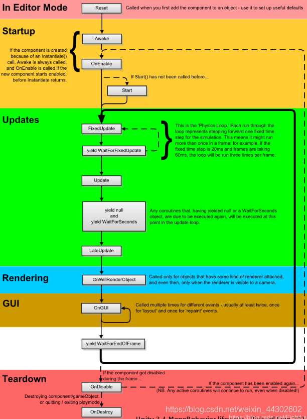
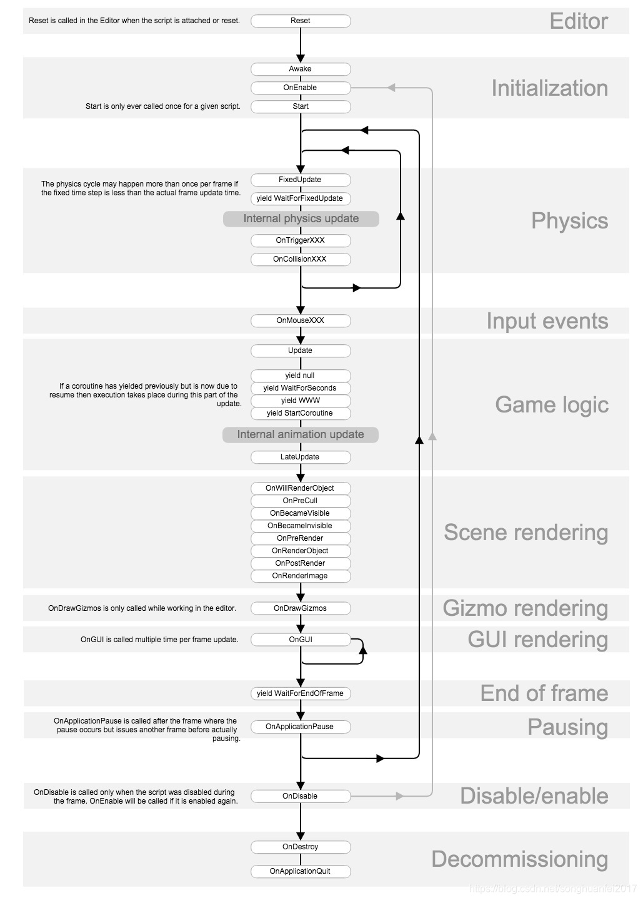

# 编程
## 1. Hello World
游戏开发属于软件开发的一个分支，自然需要用到一门编程语言，unity 中，使用 C# ，一个微软公司设计的程序开发语言

### 1.1 安装 C# 编译器
C# 编译器就是用来编写 C# 代码，并将其编译成机器可执行程序的编程工具，这里我们使用微软管饭的 Visual studio
- [下载 visual studio community 2019/2021（免费社区版](https://visualstudio.microsoft.com/zh-hans/vs/community/)），或也可以 [下载rider](https://www.jetbrains.com/zh-cn/rider/) 编辑器
- 或者在安装 unity 的同时，选择扩展工具中的 visual studio community 2019，安装

### 1.2 创建并编写 hello world
1. 打开 unity hub
2. 新建 unity 项目，选择适合的 unity 版本
3. 选择最简单的 2d 项目模板，新建
4. 在 Hierarchy 窗口中选中 Main Camera ，在右侧为其添加组件 C# script ，并命名为 HelloWorld
5. 双击 HelloWorld 脚本，会关联到 Visual Studio ，在其中编辑脚本如下：
```C#
using System.Collections;
using System.Collections.Generic;
using UnityEngine;
public class HelloWorld : MonoBehaviour {
    //在第一次帧更新之前调用Start
    void Start(){

    }
    //每帧调用一次更新
    void Update(){

    }
    //系统调用 OnGUI 来渲染和处理 GUI 事件。
    void OnGUI(){
        GUI.skin.label.fontSize = 100;
        GUI.Label(new Rect(10, 10, Screen.width, Screen.height), "Hello World!");
    }
}
```
6. 运行游戏，查看结果

### 1.3 编译输出
1. 文件 -> 生成设置 -> 选中当前场景 SampleScene
2. 平台选择 PC
3. 构建和运行，选择要存放的文件夹
4. 构建后的项目会直接运行，因为没有加入任何操作。
5. 生成三个文件，两个文件夹，全部拷贝到别的目录也可以双击 HelloWorld.exe 运行项目：
   - HelloWorld.exe
   - UnityCrashHandler64.exe
   - UnityPlayer.dll
   - HelloWorld_Data
   - MonoBleedingEdge

### 1.4 调试程序
#### 4.4.1 显示 Log
1. 在想要查看信息的位置添加代码：
   ```C#
   Debug.log(要输出的信息....); // 输出的信息必须为字符串类型
   ```
2. 打开 Unity 中的 Console（控制台） 窗口，在运行游戏时，可以查看指定的输出信息

#### 4.4.2 在 Vs 中设置断点
1. 在 Visual Studio 代码中，点击代码行前面，或点击 F9， 可以在指定行添加断点（在编译器中显示为一个红色圆点）
2. 在 vs 工具栏中选择 【Attach to Unity and Play（附加到 unity 并播放）】，编译器会在调试状态下
3. 在 Unity 中运行游戏，到断点处会自动停止执行，方便开发者查看脚本中任意信息

## 2. Unity 脚本基础
### 2.1 脚本组件
#### 2.1.1 Game Object：
Unity 中最基本的游戏元素，默认值包含 Transform 组件（变形组件），可加载其它组件（Component），根据加载的组件不同而显示出不同的特性

#### 2.1.2 Unity 脚本核心类
- MonoBehavior  
  所有 Unity 脚本的积累，提供大部分 Unity 功能，如果脚本不是继承自 MonoBehavior ，则无法将该脚本作为组件运行
- Transform  
  每个 Game Object 都包含的默认组件，提供了位置变换、旋转、缩放、父子物体连接等功能
- Rigidbody/Rigidbody2D（刚体）  
  提供所有物理功能，如重力、弹性、碰撞等

### 2.2 脚本执行顺序
- 游戏启动时，会先执行 Assembly.Load 操作，加载 /Library/ScriptAssemblies 文件夹下的当前工程相关的动态链接库（dll）文件；
- 然后，启动当前场景，并加载 Resources 目录下的资源
- 接下来，按需加载 Game Object
- 如果这个 Game Object 包含脚本组件，则脚本组件会按照下面图中顺序，执行生命周期函数  
- [脚本生命周期参考资料 1](https://blog.csdn.net/weixin_44302602/article/details/105905288)  
   
- [脚本生命周期参考资料 2](https://www.huaweicloud.com/articles/c26fc1c511e0c6a1df832a834b1196a1.html)   

  


### 2.3 脚本的序列化
#### 2.3.1 序列化 & 反序列化
> 注意： 序列化和反序列化时所说的输入输出，目标针对的都是游戏程序运行时的内存
1. 序列化（用于从内存对象到指定位置的输出）：
   从程序运行的内存中，将指定对象转换为二进制流（数据），为传输（可能是输出到硬盘文件、或传输给网络上其他电脑）做准备的过程。
2. 反序列化（用于从二进制流到内存对象的输入）：
   将二进制流，转换为内存中对象的过程

#### 2.3.2 脚本的序列化
脚本序列化是指：将脚本指定给场景中的任一 Game Object ，就可以在 Inspector 窗口中给该脚本类设置属性的初始值了

### 2.4 组件式编程
在 Unity 中，一个 Game Object 可以同时挂接多个组件，每个组件都可以有不同的功能（用代码脚本组件来实现），这就是最基本的组件式编程

- 组件式编程一般有下面几个要点：
1. 组件的获取
   通过当前游戏对象的 GetComponent<T>() 方法，可以获取指定类型的组件

   ```C#
   // 获取当前游戏对象的刚体组件
   Rigidbody rigid = this.gameObject.GetComponent<Rigidbody>();
   if(rigid == null){ //如果不存在
       //则添加一个新的刚体组件
       rigid = this.gameObject.AddComponent<Rigidbody>();
   }
   ```

2. 组件间通信
同一个 Game Object 上的不同组件间，可以通过 SendMessage 方法，通过名称调用其他组件内的方法，但效率较低且不算安全

3. 继承和组合
组件本身就是 C# 类，所以可以像普通 C# 类那样，使用继承和组合

### 2.5 协程编程
Unity 默认是单线程的，所以协程就是为了解决单线程问题（需要多线程又没有，会导致需要用多线程时，只能用单线程而造成的代码混乱）而出现的一种代码编写模式，它不是多线程，是一个模拟多线程的伪异步操作，是一种编程技巧。

> 在传统实时游戏中，在 update 中要延迟执行一些代码，或者满足一定条件后执行一些代码。需要在 update 添加一个计时器，用当前时间来减去前面记录的时间来判断执行。当这种情况越来越多的时候，会添加很多变量和代码，代码就越来越乱  
> 而协程可以说是 unity 的一个框架，为解决这个问题而设计的一个设计模式。套着这个概念来写，让这种代码非常整洁易维护而已。

- [unity 协程原理与线程的区别](https://blog.csdn.net/u011484013/article/details/51136780)
- [Unity 协程原理解析](https://www.iteye.com/blog/dsqiu-2029701)
- [为何 Unity 可以使用多线程 ，却要避免使用呢?](https://www.jianshu.com/p/854649bc0ce6)


### 2.6 管理 Unity 插件
包管理器中，可以管理 Unity 插件，比如：在 Asset Store 中下载的包，都在这里集中安装、管理

## 3. 读取资源和实例化
### 3.1 在脚本中创建第一个 Game Object （游戏对象）
```C#
//直接用类创建一个新的游戏对象
GameObject gameObject = new GameObject("MyGameObject1");
```

### 3.2 通过序列化方式引用资源
```C#
// 引用项目中的 prefab 或模型
public GameObject prefab;
// 声明一个私有的 游戏对象实例
private GameObject instance;
//程序运行时，游戏对象调用
void Start(){
    // 创建实例
    instance = Instantiate(prefab);
    // 0.1 秒后删除实例
    Destroy(instance,0.1f);
}
```

### 3.3 通过 IO 方式读取资源
Unity 中不能直接使用 C# 标准库中的 IO 函数读取资源，必须先将资源放入 Resources 文件夹中，Unity 允许多个不同的 Resources 文件夹在项目的不同路径下

使用 Resources.Load 方法读取资源，用 Instantiate 实例化资源

- [unity 资源管理的设计](https://www.cnblogs.com/zblade/p/11089050.html)
- [unity 资源加载及卸载](https://www.cnblogs.com/zblade/p/11095338.html)
- [Unity 资源加载方式](https://juejin.cn/post/6854573211984592904)
- [资源管理系统](https://zhuanlan.zhihu.com/p/96709802)


## 4. 游戏资源动态管理
### 4.1 动态获取游戏资源
```C#
public SpriteRenderer spriteRenderer;
public Sprite[] spriteArray;
void Start(){
    string path = "Assets/BirdHeroSprite.png";
    AsyncOperationHandle<Sprite[]> spriteHandle =
     Addressables.LoadAssetAsync<Sprite[]>(path);
    spriteHandle.Completed += LoadSpritesWhenReady;
}
void LoadSpritesWhenReady(AsyncOperationHandle<Sprite[]> handleToCheck){
    if(handleToCheck.Status == AsyncOperationStatus.Succeeded){
        spriteArray = handleToCheck.Result;
    }
}
```

> 参考资料： 
> - [AssetBundle 原理及使用](https://blog.csdn.net/lodypig/category_6315960.html)
> - [Unity 内存管理](https://zhuanlan.zhihu.com/p/336004123)
> - [How to change a Sprite from a script in Unity (with examples)](https://gamedevbeginner.com/how-to-change-a-sprite-from-a-script-in-unity-with-examples/)
