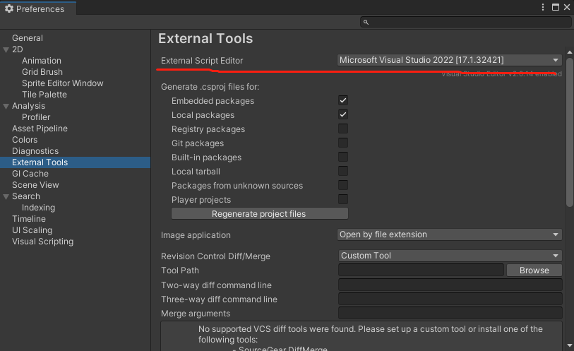

<!--
 * @features: 功能
 * @description: 说明
 * @Date: 2022-05-02 18:30:40
 * @Author: judu233(769471424@qq.com)
 * @LastEditTime: 2022-06-09 14:25:41
 * @LastEditors: judu233
-->

# Unity 入门系列 常见 Q&A

**此页面会随着大家的问题同步更新，请各位遇到问题后第一时间先来这看看**
很多小伙伴们提的问题，多有重复，Up 时间有限，会尽最大努力去帮助大家，但肯定还是无法做到全面兼顾。
所以各位在提问前，可以先来这里看看常见Q&A，说不定就能快速解决你的疑问。

> 注意：  
> 
> * 很多问题，在单机版的讨论区中，都已经有答案了，所以大家在提问前，最好先翻翻评论；  
> * 另外，提问时请务必将问题描述清楚，提供详细错误信息提示，否则无法帮助你解决。

### Q ：Unity hub 自动转换成中文版，怎么办？

A： Unity Hub 3.x 以后，会根据 ip 自动选择所在地的内容服务器，即使去国外官网，下载的 Unity Hub 也会自适应到国内的服务器。所以其中的 Learn 资源，都会是 unity.cn 上的。
如果想要国外官网丰富免费的学习资源，直接在浏览器中访问 learn.unity.com

### Q ： 安装 Unity 时，需要选择那些必须的组件？

A：如果只是学习，可以最简安装，只装 windows 支持就行，你如果不需要发布到其他操作系统，其他支持都不需要。而且 unity hub 还支持随时增删组件，以后需要时再添加即可。

### Q:  安装 Unity 时，是否每次都需要安装一次 vs comunity 2019 ?

A：千万不要！这个只需要安装一次。而且如果用 Unity Hub 安装的太慢，或者多次都不成功，那就自己到微软官网下载安装 visual studio。以后不论安装哪个版本的 unity ,都不安装 vs，只需在 Unity 的配置中，绑定你自己安装的 Viusal Studio 为默认脚本编译器即可。   

* msvs [官方下载页](https://visualstudio.microsoft.com/zh-hans/downloads/) 推荐下载 2022，企业版功能最全，但也最大，根据自己需要选择。安装时，只需要选择和 C# 开发相关的模块即可。  
* vs 安装完后，可以在 Unity 中绑定  vs : Edit->preferences 
  

### Q: 我在导入项目所需的包之后，打开项目直接报错，我并没有做任何其他操作，怎么办？

A：网速不好的同学，请尽可能选在我给大家提供的网盘上的包文件，不要从 Assets store 中下载。而且，导入包时，通常还需要在线下载一些依赖包（比如 Unity 的一些库），而这个下载源，据我判断，现阶段很有可能还是Unity的国外服务器，国内很有可能没有镜像服务器。所以很多小伙伴可能出现下载不成功，因缺少依赖文件导致项目出错。这种情况并没有很好的解决方案，只能选在网速不卡时，再次尝试。

### Q: 我导入从 up 网盘上下载的包，还是会卡死或者时间超长，为啥？

A: 同上问题，一般是网速导致的，导入时，不光是导入硬盘上的包，还会去下载相关的依赖包，而unity用的服务器是国外的

### Q: 出现空指针引用错误，未将对象实例设置到对象引用?

A : 如果排除包缺失错误后（加载完资源包后，没有错误，可以正常运行），还出现这种错误，就是你使用了没有赋值的对象，检查代码和 inspector 中，是否有没有赋值就使用的对象

### Q：加载一些比较旧的项目时，报错 Unity Deterministic compilation failed

A ： Edit→Project Settings → Player -> other setting -> 找到 Use Deterministic Compilation 取消勾选就可以了

### Q: All Compiler errors have to be fixed before you can enter playmode! 代码有错，无法运行游戏（进入游戏模式）

A : 这个就是 C# 脚本 中有严重的语法或逻辑错误（语法错误的可能性更大），导致无法编译通过，必须先修改了代码中的错误后，才能在 Unity 中点击 Play 按钮运行游戏。  
脚本错误，在 Vs 中，通常可以看到具体的错误信息提示，包括错误行数、错误原因等等，一般可以直接找到出错位置，方便改正。   

### Q：如果我并没有更改任何代码，刚加载完项目所需包，运行时就出上面的这个错误，怎么办？

A ：这种情况还是因为依赖包没有下载完全，造成代码中需要依赖这个包中类的地方，出现依赖型代码错误（缺少类库）。解决方法，现阶段还是得换网速好时重试。

### Q：移动时，tile 之间出现细线

A : 这个问题与像素舍入有关。 Unity 以“单位”处理所有内容。相机位置（以及所有东西的位置）实际上可以设置为亚像素位置。当相机位于像素之间时，屏幕上的对象相对于相机位置可能会由于舍入而稍微偏离位置。当显示在屏幕上时，位置小于半像素的对象可能会被舍入到较低的整个像素。然后下一个项目可能会在屏幕上四舍五入一个部分像素。有一些修复：

- 绘制比每单位像素宽 1 像素的图像 - 或 - 将每单位像素设置为比实际图像小 1 像素。两种情况最终都得到相同的结果。您的对象在边缘溢出 1 个像素，使它们有 1 个像素的重叠。当出现舍入问题时，他们会看到重叠的像素而不是对象之间的像素。
  在单个网格上绘制背景图块等项目。这有点复杂，但实际上有助于提高性能，因为您最终会绘制一次所有图像，而不是单独绘制每个图像。
- 仅以整像素的倍数移动对象（包括相机）。如果您有 16 个 ppu，这意味着将您的变换设置为单位的 1/16 的倍数。这可能会导致问题，四舍五入可能意味着您根本不移动（在一帧中移动不到半个像素会使您四舍五入回到您刚刚所在的像素），或者您移动得更快，因为四舍五入到像素（与上面相反，仅超过半个像素的移动和四舍五入使您更进一步）。
- 更改比例: tilemap 上的 grid size 设置为 单元格像素数/图形的 pixel per unit
- 使用 Sprite Atlas

> 参考资料：
> 
> - [https://artemdemo.com/blog/20210128-vertical-lines-between-tiles/](https://artemdemo.com/blog/20210128-vertical-lines-between-tiles/)
> - [https://tootaio.com/2021/08/rpg%e6%b8%b8%e6%88%8f%e5%bc%80%e5%8f%91-%e5%88%9b%e5%bb%ba%e5%9c%b0%e7%89%a2/](https://tootaio.com/2021/08/rpg%e6%b8%b8%e6%88%8f%e5%bc%80%e5%8f%91-%e5%88%9b%e5%bb%ba%e5%9c%b0%e7%89%a2/)
> - [https://www.sunnyvalleystudio.com/blog/unity-tilemap-how-to-fix-tearing](https://www.sunnyvalleystudio.com/blog/unity-tilemap-how-to-fix-tearing)

### Q：RayCast2D移动时，有的方向可以正常碰撞，有的方向不能，相同碰撞体

A ：忘了在碰撞盒监测时，添加速度概念

### Q: Cant add script

A: 不能添加脚本到场景,Unity中脚本的文件名称必须和脚本内的class名称一致,脚本必须继承MonoBehaviour

### Q: NullReferenceException

A: 空引用,private情况下的Unity组件，如Transform(如果是public的情况，也就是存在面板赋值的情况，会报未赋值而不是空引用),
解决方式：

1. 是不是没有拖拽、没有查找、查找了但是没找到
2. 原先并不是null，但是代码中是否有赋值为null
3. 有可能组件并不是自己身上的，那么这个组件实际挂载的对象，是不是已经被销毁了，或者这个组件被销毁了

注意：
如int、float、bool都是有默认值的，所以不初始化也不会报错,另外要特别注意，很多组件我们并不是只给一个单位使用，所以要考虑所有单位的情况，比如一群AI

### Q: UnassignedReferenceException

A: 未赋值引用,其实雷同于上一条，但是出现在“可以面板拖拽赋值”的情况

### Q: Argument Out Of RangeException

A: 参数超过范围, 一般发生在数组、列表中，一般是因为传递的索引为负数或超过了列表上限, 为什么会负数？因为你的索引可能是计算出来的

### Q: com.unity.2d.tilemap.extras@2.2.3\Runtime\Tiles error CS0246:

The type or namespace name 'RuleTile' could not be found (are you missing a using directive or an assembly reference?)
找不到类型或命名空间名称“RuleTile”（是否缺少using指令或程序集引用？）
A: tilemap.extras包和项目中导入的某些插件产生冲突，选择其中一个即可

RenderTexture 宽高不能用浮点数赋值
现象：
renderTexture.width = width
RenderTexture.Create failed: width & height must be larger than 0
RenderTexture坑

解决：
renderTexture.width = math.floor(width) -- 转成整数an 0

### Q: The type or namespace name 'AndroidExternalToolsSettings' does not exist in the namespace 'UnityEditor.Android' (are you missing an assembly reference?)
安装安卓打包模块时报错，由于找不到配置，重启自动加载解决