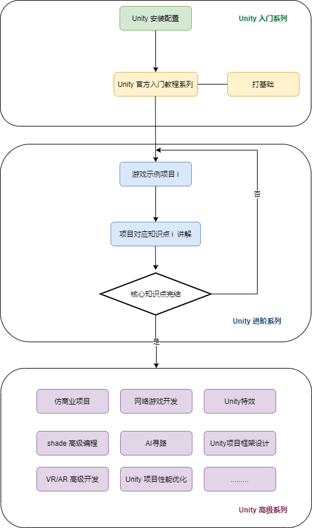
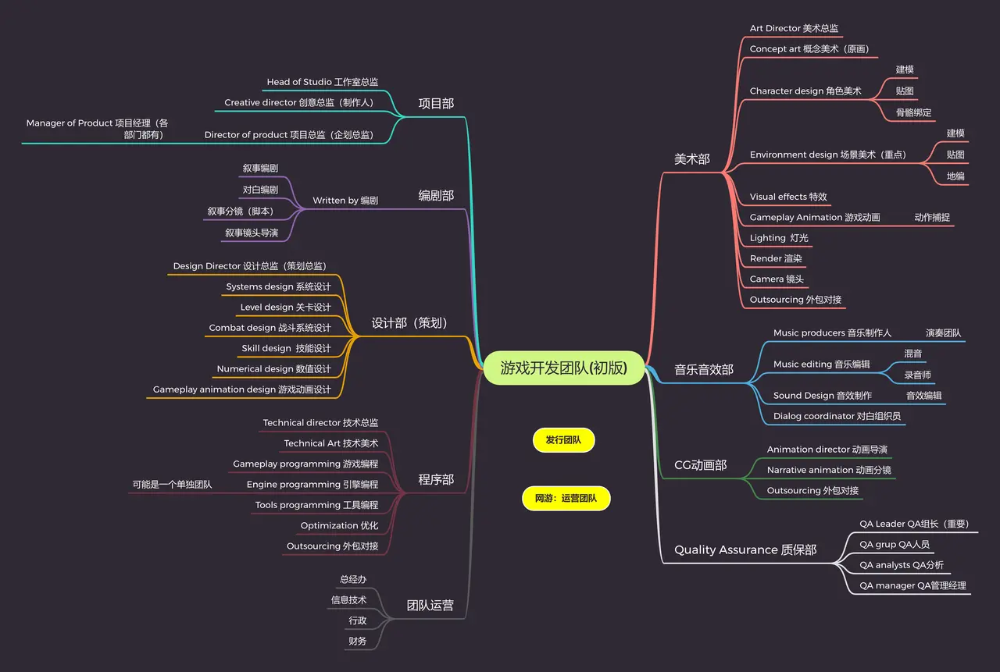

<!--
 * @features: 功能
 * @description: 说明
 * @Date: 2022-05-28 12:36:54
 * @Author: judu233(769471424@qq.com)
 * @LastEditTime: 2022-05-31 14:29:18
 * @LastEditors: judu233
-->

# AwesomeUnityTutorial
> 注意：提问前，请先查看一下文档  
> [Unity常见问题](unity/questions.md)  
> [Unity注意事项](unity/attention.md)  
> 精选官方高质量教程作为入门学习内容，选择最优学习路线，让学习过程“如丝般顺滑”；力求做全网最易学，知识最全面的游戏开发教程。

## 1. 特点
- **教程避免出现的问题：**
  - 直接开始讲怎么从零开始，做具体的某个游戏
  - 只告诉你怎么做，而不告诉为什么要这么做
  - 不考虑知识点的关联和难度递进
  - 知识点不全，且离散
  - 几个系列学完后，想要开始做自己的游戏，还是什么都不会

- **本教程设计原则**：
  - 精选官方高质量教程作为入门学习内容，选择最优学习路线，力求学习过程“如丝般顺滑”
  - 分阶段安排学习内容：入门系列 -- 进阶系列 -- 高级系列
  - 教程目标只有一个：就业。入门学完可以实习，进阶对应中级游戏开发工程师，高级系列对应高级游戏开发工程师或团队经理
  - 利用丰富的教学经验，合理安排教学内容和教学方式
  - 力求做全网最易学，知识最全面的游戏开发教程

## 2. 内容
- 官方资料
  - [官方教程、官方手册、官方](https://docs.unity3d.com/cn/2022.1/Manual/index.html) 
  - [API](https://docs.unity3d.com/cn/2022.1/ScriptReference/index.html)
  - [社区](https://developer.unity.cn/)
  - [官方论坛](https://developer.unity.cn/ask)
  - [c#官方学习文档](https://docs.microsoft.com/zh-cn/dotnet/csharp/)
  - [C#入门教程](https://learn.u3d.cn/tutorial/beginner-gameplay-scripting)
- 其他资料
  - [教程视频 B 站地址](https://space.bilibili.com/43644141/channel/seriesdetail?sid=299912)
  - [大佬文档](https://zhuanlan.zhihu.com/p/151238164)
  - [学习资源推荐](https://niuxingxing.feishu.cn/docs/doccnnlltKuoVUKwfC5BYkzsQ2f) 
- 开源游戏项目
  - [Unity Open Project](https://developer.unity.cn/projects/61c2a5faedbc2a4b811aec16)  

